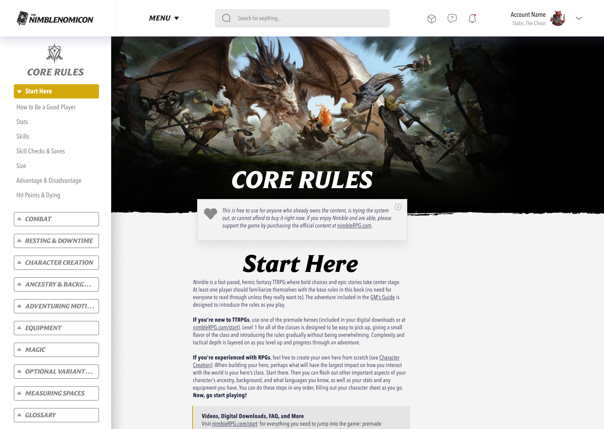

# Nimblenomicon

**An online, searchable repository of all published Nimble content**—free for anyone who has the books, can’t afford them, or is trying the system. GM tools, player tools, and resources in one place.

[](https://starlight.astro.build)

> **Early WIP.** This repo is an exploratory workspace. The vision and feature set are still being brainstormed; nothing here is committed road map. See [brainstorm.md](brainstorm.md) for the full idea dump and treat it as living, incomplete documentation.

---

## Summary of the vision

- **Smarter rules reference** — System-aware search (e.g. “easy encounter for 3 level 4 heroes”), entity browsers (spells, monsters, items, classes), rule explainers and condition cards, cross-linking and “See also” graphs, GM Screen–style quick reference, and contextual helpers (encounter difficulty, economy, level-up).
- **Interactive builders** — Character builder (art-forward class picker, ancestry/background/class wizard, HP/Wounds, spell picker, export/sharing); monster & encounter builders (level-based statlines, roles, encounter difficulty); treasure & economy tools (gold-per-level, shops, loot parcels).
- **GM flow tools** — Session and campaign planning (encounter budget, pacing, Safe Rest pressure, milestones); random tables and generators (encounters, treasure, complications, terrain); downtime and world events.
- **Player companion tools** — Trackers (HP/Wounds, mana, actions, conditions, reactions); level-up and progression aids; quick rules reference and at-the-table cheat cards.
- **Community hub** — Homebrew library (classes, monsters, spells, items, encounters); tagging and curation; remix tools (reskinner, tier adapter, encounter tuner).
- **Technical direction** — Content-first static app, fast load and snappy interaction, offline-capable core (PWA), mobile-friendly and accessible (WCAG 2.2 AA). Lessons from D&D Beyond, Demiplane, Pathbuilder, and others are captured in the brainstorm to avoid their pitfalls.

Nice-to-haves called out in the brainstorm: mobile app or installable PWA, full offline support, GM sees player rolls, PDF export, and character sharing.

Mockup snapshot:



---

## Repo contents

| File / path | Purpose |
| ----------- | ------- |
| [brainstorm.md](brainstorm.md) | Full brainstorm: detailed feature lists, market research, performance/architecture, accessibility, and UX notes. |
| [@design/mockups/](design/mockups/) | Image mockups and UI sketches for early exploration. |
| [.app/](.app/) | Astro + [Starlight](https://starlight.astro.build) documentation site (Tailwind). See [Documentation site](#documentation-site-app) below. |

---

## Documentation site (`.app`)

The docs app lives under [`.app/`](.app/). It uses Starlight with [Tailwind CSS](https://starlight.astro.build/guides/css-and-tailwind/#tailwind-css) for styling (`src/styles/global.css`).

### Project structure

```
.app/
├── public/
├── src/
│   ├── assets/
│   ├── content/
│   │   └── docs/
│   ├── styles/
│   │   └── global.css
│   └── content.config.ts
├── astro.config.mjs
├── package.json
└── tsconfig.json
```

Starlight serves `.md` or `.mdx` files from `src/content/docs/` as routes based on file names. Images go in `src/assets/` (embed with relative links). Static assets such as favicons go in `public/`.

### Commands

Run these from `.app/` (after `cd .app`):

| Command | Action |
| :------ | :----- |
| `npm install` | Installs dependencies |
| `npm run dev` | Starts local dev server at `localhost:4321` |
| `npm run build` | Build production site to `./dist/` |
| `npm run preview` | Preview the build locally before deploying |
| `npm run astro ...` | CLI commands such as `astro add`, `astro check` |
| `npm run astro -- --help` | Astro CLI help |

### Learn more

- [Starlight docs](https://starlight.astro.build/)
- [Astro documentation](https://docs.astro.build)
- [Astro Discord](https://astro.build/chat)

---

Nimblenomicon is based on **Nimble Core Rules 2.0.2** and **Creator’s Kit 1.2**. The vault and tooling are intended to complement the official books, not replace them.

---

## Links

- [Contributing](CONTRIBUTING.md)
- [Code of Conduct](CONTRIBUTING.md#code-of-conduct)
